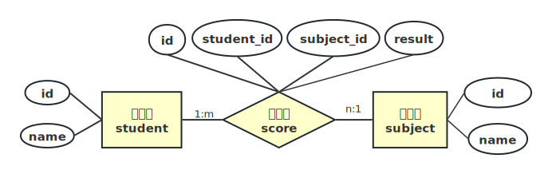
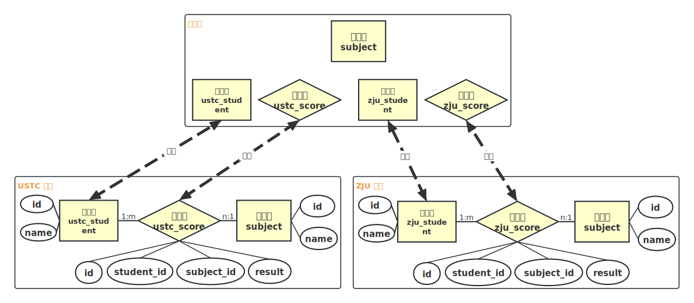

# mybatis-plus 实现查询表名的动态修改

通过 mybatis-plus 实现表名的动态替换，即通过配置或入参动态选择不同的表。

下面通过一个例子来说明该需求: 我们需要为学校开发一个成绩管理系统，需要建立三张表: 学生表、科目表和成绩表，表的 ER 图如下所示。



对应的建表语句如下:

```sql
-- 学科表
drop table if exists subject;
create table subject(id int primary key , name varchar(64));

-- 学生表
drop table if exists student;
create table student (id int primary key , name varchar(64));

-- 成绩表(学生-学科 多对多)
drop table if exists score;
create table score(id int primary key , student_id int, subject_id int, result int);
```

根据三张表级联查询成绩的查询语句为: 

```sql
select subject.name as subject_name, student.name as student_name, score.result as score
    from score, student, subject where score.student_id=student.id and score.subject_id=subject.id;
```

现在又来了一个新需求，我们的这套成绩查询系统需要部署在不同学校的服务器上，因为每个学校的学生表和成绩表都要同步到教育局的服务器中，因此需要为这两个表添加学校前缀，ER 图如下所示。



不同学校的建表语句不同，对于 USTC 学校而言，建表语句为:

```sql
-- 学科表
drop table if exists subject;
create table subject(id int primary key , name varchar(64));

-- 学生表
drop table if exists ustc_student;
create table ustc_student (id int primary key , name varchar(64));

-- 成绩表(学生-学科 多对多)
drop table if exists ustc_score;
create table ustc_score(id int primary key , student_id int, subject_id int, result int);
```

对于 ZJU 学校而言，建表语句为:

```sql
-- 学科表
drop table if exists subject;
create table subject(id int primary key , name varchar(64));

-- 学生表
drop table if exists zju_student;
create table zju_student (id int primary key , name varchar(64));

-- 成绩表(学生-学科 多对多)
drop table if exists zju_score;
create table zju_score(id int primary key , student_id int, subject_id int, result int);
```

我们的成绩查询系统会安装在不同的学校，并且校名是动态可配的，因此该成绩查询系统需要根据配置文件动态修改 sql 语句表名的功能。

## 实现

源码地址: https://github.com/foolishflyfox/blog/tree/main/backend-code/mp-dynamic-tablename

### 数据库初始化

创建程序需要的表:

```sql
create database if not exists mp_dynamic_tablename_test;

use mp_dynamic_tablename_test;

-- 学科表
drop table if exists subject;
create table subject(id int primary key , name varchar(64));
insert into subject(id, name) values (1, 'Math'), (2, 'English'), (3, 'Chinese');

-- 学生表
drop table if exists student;
create table student (id int primary key , name varchar(64));
insert into student(id, name) values(1, 'aaa'), (2, 'bbb');

-- 成绩表(学生-学科 多对多)
drop table if exists score;
create table score(id int primary key , student_id int, subject_id int, result int);
insert into score(id, student_id, subject_id, result) values (1, 1, 1, 74), (2, 1, 2, 83), (3, 1, 3, 69),
    (4, 2, 1, 91), (5, 2, 3, 87);

-- 指定前缀 ustc 的表
-- 学生表
drop table if exists ustc_student;
create table ustc_student (id int primary key , name varchar(64));
insert into ustc_student(id, name) values(1, 'u_aaa'), (2, 'u_bbb');

-- 成绩表(学生-学科 多对多)
drop table if exists ustc_score;
create table ustc_score(id int primary key , student_id int, subject_id int, result int);
insert into ustc_score(id, student_id, subject_id, result) values (1, 1, 1, 89), (2, 1, 2, 81), (3, 1, 3, 32),
                                                             (4, 2, 1, 71), (5, 2, 2, 77);

-- 指定前缀 zju 的表
-- 学生表
drop table if exists zju_student;
create table zju_student (id int primary key , name varchar(64));
insert into zju_student(id, name) values(5, 'z_aaa'), (6, 'z_bbb');

-- 成绩表(学生-学科 多对多)
drop table if exists zju_score;
create table zju_score(id int primary key , student_id int, subject_id int, result int);
insert into zju_score(id, student_id, subject_id, result) values (1, 5, 1, 91), (2, 5, 2, 66), (3, 5, 3, 85),
                                                                  (4, 6, 1, 48), (5, 6, 2, 59);
```

### 依赖包

需要引入 spring-boot-starter-web、spring-boot-starter-test、spring-boot-configuration-processor、mybatis-plus-boot-starter、mysql-connector-java、lombok 库。

### 配置读取类

我们先定义一个配置读取类，用于获取动态配置的学校以及需要动态添加学校前缀的表名。

```java
package cn.fff.config.properties;

import lombok.Data;
import org.springframework.boot.context.properties.ConfigurationProperties;
import org.springframework.stereotype.Component;

import java.util.HashSet;
import java.util.Set;

@Component
@ConfigurationProperties("school")
@Data
public class SchoolProperties {
    /** 学校名，动态表名会添加前缀: 学校名_ */
    private String name;
    /** 需要动态添加前缀的表 */
    private Set<String> dynamicTables = new HashSet<>();
}
```

为 application.yml 添加如下配置:

```yml
school:
  name: ustc
  dynamic-tables:
    - student
    - score
```

表示需要为 `student` 和 `score` 动态添加前缀 `ustc`，即查询 `student` 表时会动态替换为 `ustc_student`，查询 `score` 表时会动态替换为 `ustc_score`。如果 `school.name` 修改为 `zju`，则查询 `student` 表时会动态替换为 `zju_student`，查询 `score` 表时会动态替换为 `zju_score`。

### 设置 mybatis-plus 插件

实体类、mapper、服务类的创建比较基础，此处略过，可直接查看源码。动态表面主要通过创建一个 mybatis 插件实现:

```java
package cn.fff.config.mp;

import cn.fff.config.properties.SchoolProperties;
import com.baomidou.mybatisplus.extension.plugins.MybatisPlusInterceptor;
import com.baomidou.mybatisplus.extension.plugins.inner.DynamicTableNameInnerInterceptor;
import org.springframework.beans.factory.annotation.Autowired;
import org.springframework.context.annotation.Bean;
import org.springframework.context.annotation.Configuration;
import org.springframework.util.StringUtils;

@Configuration
public class DynamicTableNameConfig {
    @Autowired
    private SchoolProperties schoolProperties;

    @Bean
    public MybatisPlusInterceptor mybatisPlusInterceptor() {
        MybatisPlusInterceptor interceptor = new MybatisPlusInterceptor();
        interceptor.addInnerInterceptor(dynamicTableNameInnerInterceptor());
        return interceptor;
    }

    private DynamicTableNameInnerInterceptor dynamicTableNameInnerInterceptor() {
        DynamicTableNameInnerInterceptor innerInterceptor = new DynamicTableNameInnerInterceptor();
        innerInterceptor.setTableNameHandler((sql, tableName) -> {
            String newTableName = tableName;
            // 配置了学校名并且当前查询的表名在指定配置中，则添加表名前缀
            if (StringUtils.hasLength(schoolProperties.getName())
                    && schoolProperties.getDynamicTables().contains(tableName)) {
                newTableName = schoolProperties.getName() + "_" + tableName;
            }
            return newTableName;
        });

        return innerInterceptor;
    }
}
```

## 测试

在 test 中创建一个测试类 `ScoreServiceTest` :

```java
package cn.fff;

import cn.fff.entity.StudentScore;
import cn.fff.service.ScoreService;
import org.junit.jupiter.api.Test;
import org.springframework.beans.factory.annotation.Autowired;
import org.springframework.boot.test.context.SpringBootTest;

import java.util.List;

@SpringBootTest
public class ScoreServiceTest {

    @Autowired
    private ScoreService scoreService;

    @Test
    public void testDynameTableName() {
        List<StudentScore> studentScores = scoreService.queryStudentScore();
        studentScores.forEach(e -> System.out.printf("%s %s %d\n", e.getStudentName(), e.getSubjectName(), e.getScore()));
    }
}
```

当 `school.name` 为 ustc 时，输出为：

```
u_aaa Math 89
u_aaa English 81
u_aaa Chinese 32
u_bbb Math 71
u_bbb English 77
```

当 `school.name` 为 zju 时，输出为:

```
z_aaa Math 91
z_aaa English 66
z_aaa Chinese 85
z_bbb Math 48
z_bbb English 59
```

这样我们就实现了根据配置动态切换操作表名的功能。


